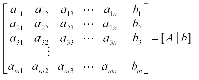

# Gauss-jordan Method 

This program implement the gauss-jordan method for solving system of linear equations. This is part of an exercise from numerical analysis class.

```
 Gauss-jordan method is the process of performing row operations to transform any 
 matrix into (reduced) row echelon form. In reduced row echelon form, each successive 
 row of the matrix has less dependencies than the previous, so solving systems of 
 equations is a much easier task. 
```

## How to build and run

Build with make:

```
$ make
```
Run:

```
$ ./gauss-jordan-method
```

### Input

One augmented matrix of a linear system

<p align="center">
	
</p>

#### Output

Print the original matrix, the diagonal matrix equivalent of the original,the type of linear system and one solution for it, if exist. 

## Example


```
$ ./gauss-jordan-method
Quantidade de variaveis: 3
M[1][1]=1
M[1][2]=5
M[1][3]=-2
M[1][4]=11
M[2][1]=-2
M[2][2]=4
M[2][3]=1
M[2][4]=3
M[3][1]=3
M[3][2]=-1
M[3][3]=4
M[3][4]=11

     1.000     5.000    -2.000    11.000
    -2.000     4.000     1.000     3.000
     3.000    -1.000     4.000    11.000
Matriz diagonalizada

     1.000     0.000     0.000     3.000
     0.000    14.000     0.000    28.000
     0.000     0.000     6.571     6.571
SL DETERMINADO
x[1]=     3.000
x[2]=     2.000
x[3]=     1.000
```
